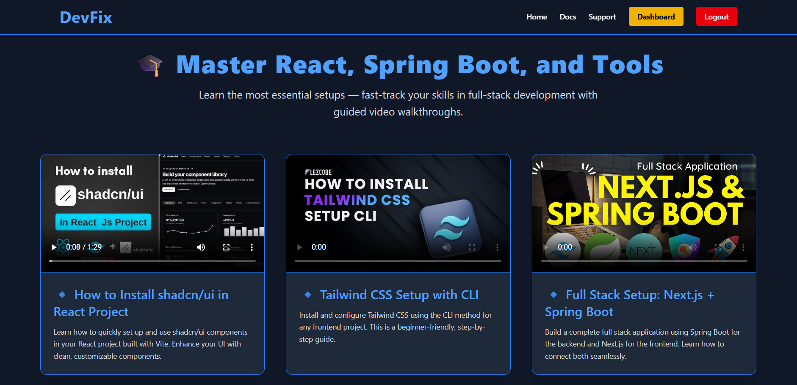
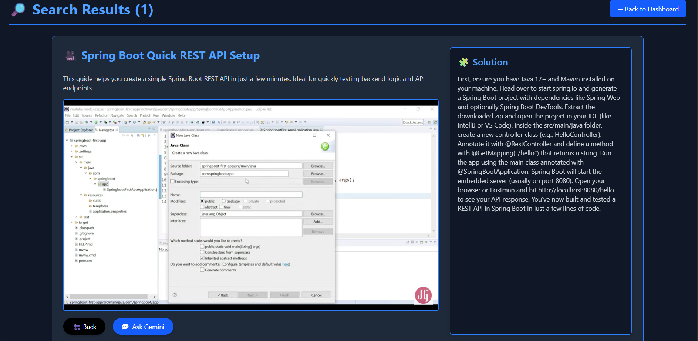
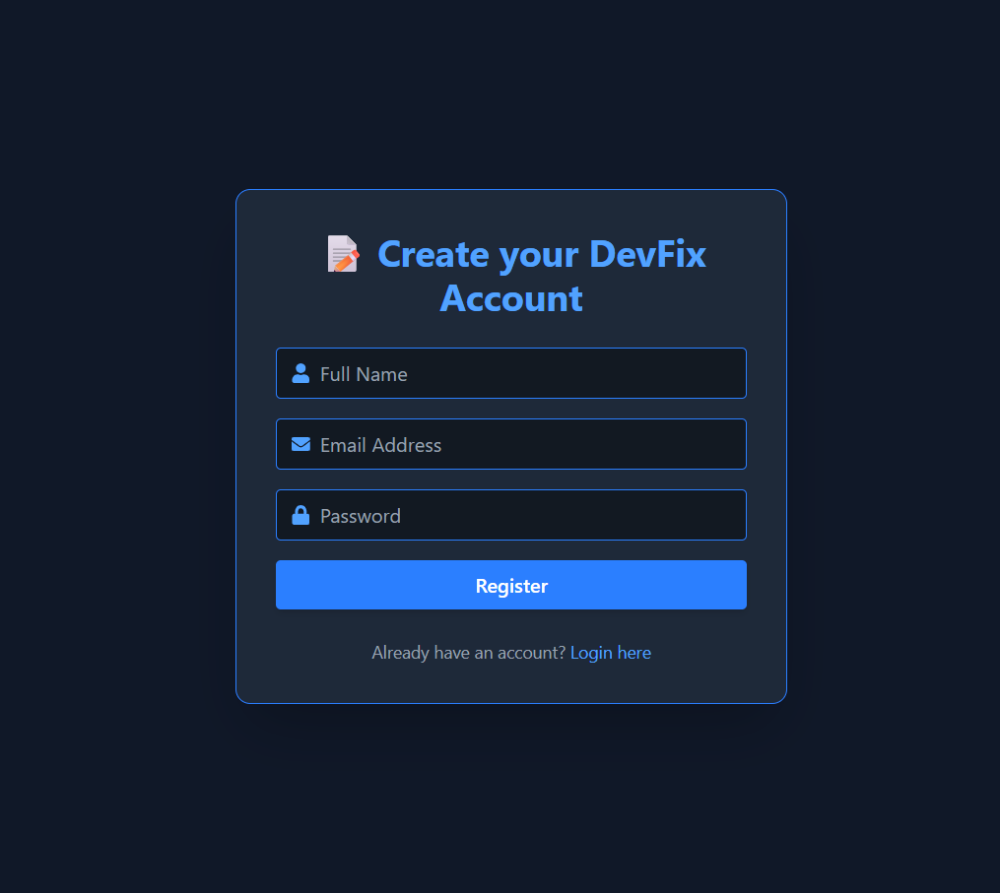
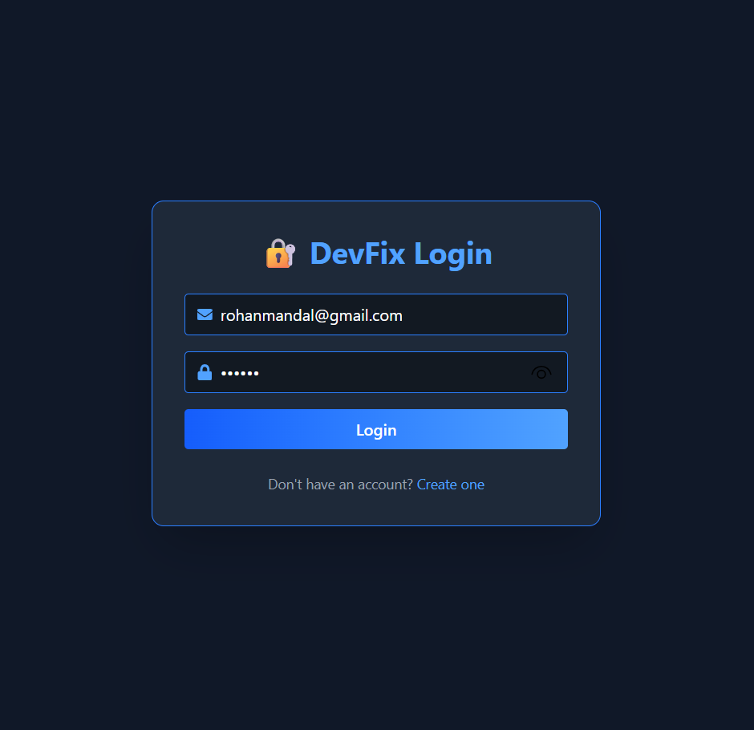
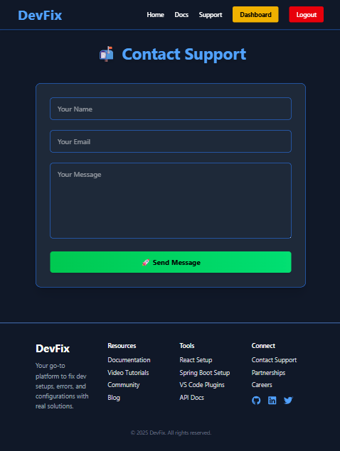
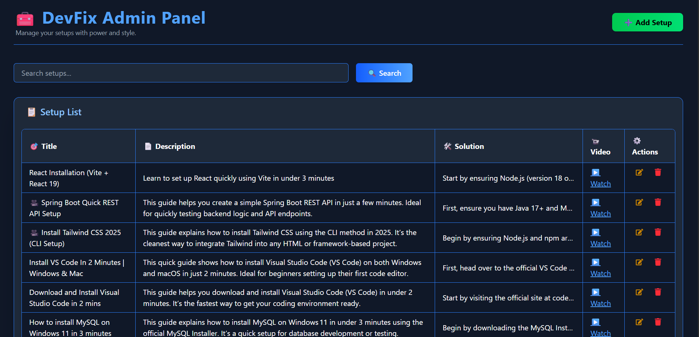

# 🚀 DevFix – Developer Setup Simplified

**DevFix** is a smart search platform that gives you instant 2–3 minute setup videos, clear solution steps, and Gemini AI support — so you can skip long YouTube videos and confusing blogs.

---

## 📸 Screenshots

### 🏠 Homepage


---

### 📘 Info + Contact Section


---

### 🔎 Search Result Page


---

### 🔐 Auth & Contact (Side-by-Side)
| Register                             | Login                               | Contact Support                      |
|-------------------------------------|-------------------------------------|--------------------------------------|
|  |  |  |

---

### 🛠️ Admin Panel + Add Content
| Admin Dashboard                     | Add Content                         |
|------------------------------------|-------------------------------------|
|   |  |

---

## ✨ Features

- 🔍 Search any tool/setup name
- 🎥 Get short 2–3 min installation videos
- 📋 Read solution steps immediately
- 🤖 Ask Gemini AI if you still have doubts
- 🔐 JWT-secured login and register
- 🛠️ Admin panel to add, edit, delete setups
- 📩 Contact support form

---

## 🛠️ Tech Stack

- **Frontend:** React + Vite + TailwindCSS
- **Backend:** Spring Boot + REST API
- **Auth:** JWT (Admin/User roles)
- **AI Integration:** Gemini API
- **Database:** PostgreSQL

---

## 📂 Folder Structure
```bash
DevFix/
├── DevFix-frontend/ # React + Vite (client)
├── DevFix-backend/ # Spring Boot (server)
├── README.md
└── screenshots/ # UI Screenshots
```

---
## 📂 Folder Structure

```text
DevFix/
├── DevFix-frontend/     # React + Vite (Client)
├── DevFix-backend/      # Spring Boot (Server)
├── README.md            # Project Documentation
└── screenshots/         # UI Screenshots
```

---

## 🚀 Getting Started Locally

### Backend

```bash
cd DevFix-backend
./mvnw spring-boot:run
```
Or run DevFixApplication.java in your IDE.

###Frontend
```bash
cd DevFix-frontend
npm install
npm run dev
```
---
### 🔗 Key Pages

| Page             | Description                                      |
|------------------|--------------------------------------------------|
| `/home`          | Homepage with search bar                         |
| `/register`      | User registration                                |
| `/login`         | User login                                       |
| `/dashboard`     | Admin dashboard with table of setups             |
| `/add`           | Add new setup data                               |
| `/search-result` | View matched video + solution + Gemini AI        |

---

## 🧑‍💻 Author

**Rohan Mandal**  
GitHub: [@rohanmandal341](https://github.com/rohanmandal341)

---

### 📝 License

This project is licensed under the **MIT License**.
